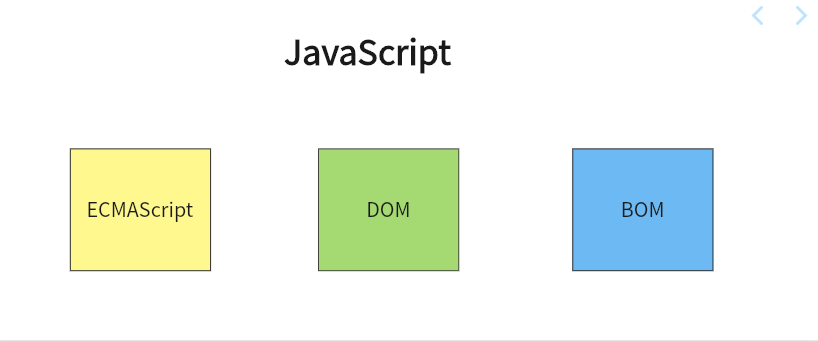

# JavaScript简介

## 什么是语言

计算机就是一个由人来控制的机器，人让它干嘛，它就得干嘛。

我们要学习的语言就是人和计算机交流的工具，人类通过语言来控制、操作计算机。

编程语言和我们说的中文、英文本质上没有区别，只是语法比较特殊。

语言的发展：

- 纸带机：机器语言
- 汇编语言：符号语言
- 现代语言：高级语言

## JS是什么

JavaScript一种直译式脚本语言，是一种动态类型、弱类型、基于原型的语言，内置支持类型。它的解释器被称为JavaScript引擎，为浏览器的一部分，广泛用于客户端的脚本语言，最早是在HTML（标准通用标记语言下的一个应用）网页上使用，用来给HTML网页增加动态功能

## JavaScript的历史

- 开始于网景
  - 1993年，伊利诺伊大学厄巴纳-尚佩恩分校的国家超级电脑应用中心（NCSA）发表了NCSA Mosaic，这是最早流行的图形接口网页浏览器，它在万维网的普及上发挥了重要作用。1994年，一家名为Mosaic Communications的公司在加州芒廷维尤成立了，并雇用了许多原来的NCSA Mosaic开发者用来开发Mosaic Netscape，该公司的目标是取代NCSA Mosaic成为世界第一的网页浏览器。第一个版本的网页浏览器Mosaic Netscape 0.9于1994年底发布。在四个月内，已经占据了四分之三的浏览器市场，并成为1990年代互联网的主要浏览器。为避免NCSA的商标所有权问题，该浏览器于同年更名为Netscape Navigator，该公司命名为Netscape Communications。网景预见到网络需要变得更动态。公司的创始人马克·安德森认为HTML需要一种胶水语言，让网页设计师和兼职程序员可以很容易地使用它来组装图片和插件之类的组件，且代码可以直接编写在网页标记中。
  - 1995年，网景招募了布兰登·艾克，目标是把Scheme语言嵌入到Netscape Navigator浏览器当中。但更早之前，网景已经跟昇阳合作在Netscape Navigator中支持Java，这时网景内部产生激烈的争论。后来网景决定发明一种与Java搭配使用的辅助脚本语言并且语法上有些类似，这个决策导致排除了采用现有的语言，例如Perl、Python、Tcl或Scheme。为了在其他竞争提案中捍卫JavaScript这个想法，公司需要有一个可以运作的原型。艾克在1995年5月仅花了十天时间就把原型设计出来了。
  - 最初命名为Mocha，1995年9月在Netscape Navigator 2.0的Beta版中改名为LiveScript，同年12月，Netscape Navigator 2.0 Beta 3中部署时被重命名为JavaScript，当时网景公司与昇阳电脑公司组成的开发联盟为了让这门语言搭上Java这个编程语言“热词”，因此将其临时改名为JavaScript，日后这成为大众对这门语言有诸多误解的原因之一。

- 微软采纳
  - JavaScript推出后在浏览器上大获成功，微软公司在不久后就为Internet Explorer 3浏览器推出了JScript，以与处于市场领导地位的网景产品同台竞争。JScript也是一种JavaScript实现，这两个JavaScript语言版本在浏览器端共存意味着语言标准化的缺失，发展初期，JavaScript的标准并未确定，同期有网景的JavaScript，微软的JScript双峰并峙。除此之外，微软也在网页技术上加入了不少专属对象，使不少网页使用非微软平台及浏览器无法正常显示，导致在浏览器大战期间网页设计者通常会把“用Netscape可达到最佳效果”或“用IE可达到最佳效果”的标志放在主页。随着Internet Explorer 4的发布，微软引入了动态HTML的概念，但语言实现和不同专有化的文档对象模型的差异仍然存在，成为网络上普及使用JavaScript的阻碍。

- 标准化
  - 1996年11月，网景正式向ECMA（欧洲计算机制造商协会）提交语言标准。1997年6月，ECMA以JavaScript语言为基础制定了ECMAScript标准规范ECMA-262。JavaScript成为了ECMAScript最著名的实现之一。除此之外，ActionScript和JScript也都是ECMAScript规范的实现语言。尽管JavaScript作为给非程序人员的脚本语言，而非作为给程序人员的脚本语言来推广和宣传，但是JavaScript具有非常丰富的特性。

## 实现

ECMAScript是一个标准，而这个标准需要由各个厂商去实现。不同的浏览器厂商对该标准会有不同的实现

| 浏览器            | **JavaScript**实现方式 |
| ----------------- | ---------------------- |
| FireFox           | SpiderMonkey           |
| Internet Explorer | JScript/Chakra         |
| Safari            | JavaScriptCore         |
| Chrome            | V8                     |
| Carakan           | Carakan                |

我们已经知道ECMAScript是JavaScript标准，所以一般情况下这两个词我们认为是一个意思。但是实际上JavaScript的含义却要更大一些。

一个完整的JavaScript实现应该由以下三个部分构成：

所以说学习的重点也就是：

- ECMAScript
- DOM
- BOM

## JS特点

- 脚本语言。JavaScript是一种解释型的脚本语言,C、C++等语言先编译后执行,而JavaScript是在程序的运行过程中逐行进行解释
- 基于对象。JavaScript是一种基于对象的脚本语言,它不仅可以创建对象,也能使用现有的对象。
- 简单。JavaScript语言中采用的是弱类型的变量类型,对使用的数据类型未做出严格的要求,是基于Java基本语句和控制的脚本语言,其设计简单紧凑
- 动态性。JavaScript是一种采用事件驱动的脚本语言,它不需要经过Web服务器就可以对用户的输入做出响应。在访问一个网页时,鼠标在网页中进行鼠标点击或上下移、窗口移动等操作JavaScript都可直接对这些事件给出相应的响应
- 跨平台性。JavaScript脚本语言不依赖于操作系统,仅需要浏览器的支持。因此一个JavaScript脚本在编写后可以带到任意机器上使用,前提上机器上的浏览器支 持JavaScript脚本语言,目前JavaScript已被大多数的浏览器所支持
