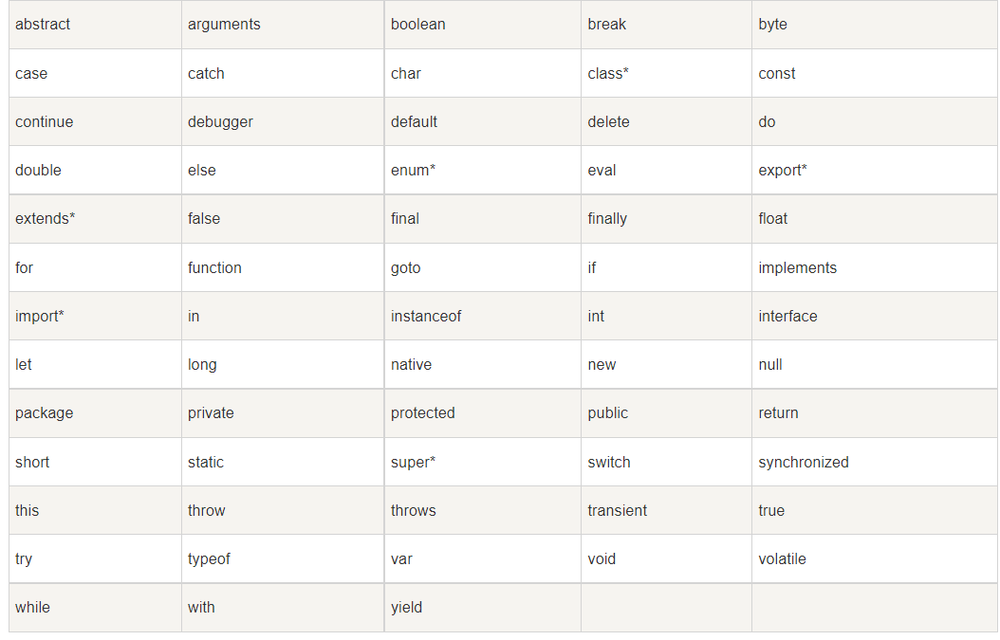
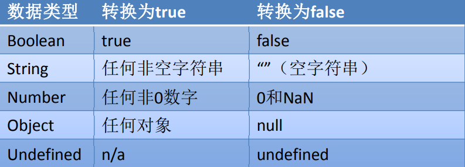

## 编写位置

- 我们目前学习的JS全都是客户端的JS，也就是说全都是需要在浏览器中运行的，所以我们我们的JS代码全都需要在网页中编写
- 我们的JS代码需要编写到script标签中
- 我们一般将script标签写到body下方
-  属性：

  - type：默认值text/javascript可以不写，不写也是这个值。
  - src：当需要引入一个外部的js文件时，使用该属性指向文件的地址。


## Hello World

```js light
<script type="text/javascript">
	console.log("Hello World");
</script>
```

## 严格区分大小写 

-  JavaScript是严格区分大小写的，也就是abc和Abc会被解析器 认为是两个不同的东西。
-  所以在编写上边的HelloWorld时，一定要注意区分大小写。

- 注释 
-  注释中的内容不会被解析器解析执行，但是会在 源码中显示，我们一般会使用注释对程序中的内 容进行解释。
-  JS中的注释和Java的的一致，分为两种：
  - 单行注释：//注释内容 
  - 多行注释：/**注释内容 */

## 标识符

-  所谓标识符，就是指变量、函数、属性的名字，或函数的参数。
-  标识符可以是按照下列格式规则组合起来的一或多个字符： 
  - 第一个字符必须是一个字母、下划线（ _ ）或一个美元符号（ $ ）。 
  - 其他字符可以是字母、下划线、美元符号或数字。 
- 按照惯例，ECMAScript 标识符采用驼峰命名法。
- 但是要注意的是JavaScript中的标识符不能是关键字和保留字符



\* 标记的关键字是 ECMAScript5 中新添加的。

## 变量

-  变量的作用是给某一个值或对象标注名称。 
-  比如我们的程序中有一个值123，这个值我们是需要反复使用的，这个时候 我们最好将123这个值赋值给一个变量，然后通过变量去使用123这个值。 
- 变量的声明：
  - 使用var关键字声明一个变量
  - var a; 
- 变量的赋值
  -  使用=为变量赋值
  - a=123; 
- 声明和赋值同时进行：
  - var a = 123

## 数据类型 

- 数据类型决定了一个数据的特征，比如：123和”123”，直观上看这两个 数据都是123，但实际上前者是一个数字，而后者是一个字符串
- 对于不同的数据类型我们在进行操作时会有很大的不同。 
- JavaScript中一共有5种基本数据类型： 
  - 字符串型（String） 
  - 数值型（Number）
  - 布尔型（Boolean）
  - null型（Null） 
  - undefined型（Undefined） 
-  这5种之外的类型都称为Object，所以总的来看JavaScript中共有六种数据类型

## typeof运算符 

- 使用typeof操作符可以用来检查一个变量的数据类型。 
- 使用方式：typeof 数据，例如 typeof 123。 
- 返回结果： 
  - typeof 数值 "number "
  - typeof 字符串 "string "
  - typeof 布尔型 "boolean"
  - typeof undefined "undefined"
  - typeof null "object"

## String 

- String用于表示一个字符序列，即字符串
-  字符串需要使用 ’或“ 括起来
- 将其他数值转换为字符串有三种方式：toString()、String()、 拼串

## Number 

- Number 类型用来表示整数和浮点数，最常用的功能就是用来 表示10进制的整数和浮点数
-  Number表示的数字大小是有限的，范围是： – ± 1.7976931348623157e+308 – 如果超过了这个范围，则会返回± Infinity
-  NaN，即非数值（Not a Number）是一个特殊的数值，JS中 当对数值进行计算时没有结果返回，则返回NaN。

## 数值的转换 

-  有三个函数可以把非数值转换为数值：Number()、parseInt() 和parseFloat()
-  Number()可以用来转换任意类型的数据，而后两者只能用于 转换字符串
- parseInt()只会将字符串转换为整数，而parseFloat()可以转换 为浮点数

## Boolean(布尔型) 

布尔型也被称为逻辑值类型或者真假值类型

布尔型只能够取真（true）和假（false）两种数值。除此以外， 其他的值都不被支持

 其他的数据类型也可以通过Boolean()函数转换为布尔类型

 转换规则:



## Undefined 

- Undefined 类型只有一个值，即特殊的 undefined
- 在使用 var 声明变量但未对其加以初始化时，这个变量的值就 是 undefined。例如： 
  - var message; 
  - message 的值就是 undefined。
- 需要注意的是typeof对没有初始化和没有声明的变量都会返回 undefined

## Null 

-  Null 类型是第二个只有一个值的数据类型，这个特殊的值是 null 
- 从语义上看null表示的是一个空的对象。所以使用typeof检查 null会返回一个Object
- undefined值实际上是由null值衍生出来的，所以如果比较 undefined和null是否相等，会返回true
