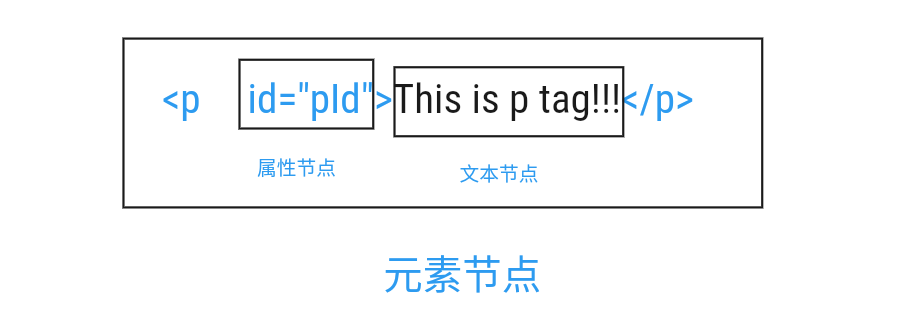

## 什么是DOM

- DOM，全称Document Object Model文档对象模型

- JS中通过DOM来对HTML文档进行操作。只要理解了DOM就可以随心所欲的操作WEB页面

- 文档：文档表示的就是整个的HTML网页文档

- 对象：对象表示将网页中的每一个部分都转换为了一个对象

- 模型 ：使用模型来表示对象之间的关系，这样方便我们获取对象

  ```html
  <html>
      <head>
      	<title>网页的标题</title>
      </head>
      <body>
          <a href="1.html" >超连接</a>
      </body>
  </html>
  ```

  


## 节点 

​	节点的概念

- 节点Node，是构成我们网页的最基本的组成部分，网页中的 每一个部分都可以称为是一个节点
-  比如：html标签、属性、文本、注释、整个文档等都是一个节 点
- 虽然都是节点，但是实际上他们的具体类型是不同的
- 比如：标签我们称为元素节点、属性称为属性节点、文本称为文本节点、文档称为文档节点
- 节点的类型不同，属性和方法也都不尽相同

常用节点分为四类 

- 文档节点：整个HTML文档
- 元素节点：HTML文档中的HTML标签
- 属性节点：元素的属性
- 文本节点：HTML标签中的文本内容



## 获取元素节点 

### 获取节点

通过document对象调用 
  - getElementById()  `方法` ，通过id属性获取一个元素节点对象 
  - getElementsByTagName()  `方法`  ，通过标签名获取一组元素节点对象 
  - getElementsByName() `方法` ， 通过name属性获取一组元素节点对象

### 获取子节点

通过具体的元素节点调用

- getElementsByTagName() `方法`，返回当前节点的指定标签名后代节点 
- childNodes 属性`，表示当前节点的所有子节点 
- firstChild  `属性`，表示当前节点的第一个子节点 
- lastChild `属性`，表示当前节点的最后一个子节点

### 获取父节点

通过具体的节点调用 

- parentNode  `属性`，表示当前节点的父节点 
- previousSibling  `属性`，表示当前节点的前一个兄弟节点
- nextSibling  `属性`，表示当前节点的后一个兄弟节点

## 元素节点的属性

获取，元素对象.属性名 例：

`element.value` 

`element.id `

`element.className `

设置，元素对象.属性名=新的值 例： 

`element.value = "hello" `

`element.id = "id01" `

`element.className = "newClass"`

## 其他属性 

- nodeValue 
  - 文本节点可以通过nodeValue属性获取和设置 文本节点的内容

- innerHTML 
  - 元素节点通过该属性获取和设置标签内部的 html代码

## 使用CSS选择器进行查询 

`querySelector() `

`querySelectorAll() `

这两个方法都是用document对象来调用，两个方法使用相同， 都是传递一个选择器字符串作为参数，方法会自动根据选择器 字符串去网页中查找元素

不同的地方是`querySelector()`只会返回找到的第一个元素，而 `querySelectorAll()`会返回所有符合条件的元素

## 节点的修改

这里的修改我们主要指对元素节点的操作

创建节点
`document.createElement(标签名)`

删除节点 
`父节点.removeChild(子节点) `

替换节点
`父节点.replaceChild(新节点 , 旧节点) `

插入节点
`父节点.appendChild(子节点) `
`父节点.insertBefore(新节点 , 旧节点)`