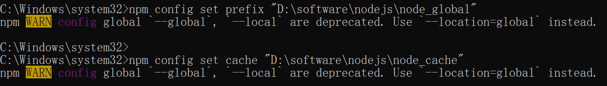

## 下载 Nodejs

[最新下载地址](http://nodejs.cn/download/)

[以前旧版本](https://registry.npmmirror.com/binary.html?path=node/)

> 注意：win7 最高支持到 12

## 安装

配置好安装目录，正常下一步安装即可

## 配置

配置自定义的全局模块安装目录

在 node.js 安装目录下新建两个文件夹 node_global 和 node_cache

然后在 cmd 命令下执行如下两个命令：

```shell light
//配置全局模块存放路径
npm config set prefix "D:\software\nodejs\node_global"
//cache路径
npm config set cache "D:\software\nodejs\node_cache"
```



执行完后，配置环境变量

编辑`path`,新增`全局模块存放路径`,例如：`D:\software\nodejs\node_global`

然后在 cmd 命令下执行如下两个命令查询`nodejs`版本和`npm`的版本

```shell light
node -v
npm -v
```

## 设置淘宝镜像

```shell light
npm config set registry " https://registry.npm.taobao.org
```
