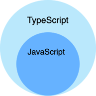
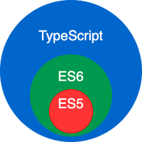

## TypeScript 概述

### 什么是 TypeScript

- TypeScript 是 JavaScript 的一个超集，支持 ECMAScript 6 标准（ES6 教程）。
- TypeScript 由微软开发的自由和开源的编程语言。

- TypeScript 设计目标是开发大型应用，它可以编译成纯 JavaScript，编译出来的 JavaScript 可以运行在任何浏览器上。

- TypeScript 本身并非什么高深的技术，凡是有 JavaScript 基础的同学都可以轻松掌握

### 特性

- TypeScript 是一种给 JavaScript 添加特性的语言扩展。增加的功能包括：

  - 类型批注和编译时类型检查
  - 类型推断
  - 类型擦除
  - 接口
  - 枚举
  - Mixin
  - 泛型编程
  - 名字空间
  - 元组
  - Await

- 以下功能是从 ECMA 2015 反向移植而来：
  - 类
  - 模块
  - lambda 函数的箭头语法
  - 可选参数以及默认参数

### 区别

- TypeScript 是 JavaScript 的超集，扩展了 JavaScript 的语法，因此现有的 JavaScript 代码可与 TypeScript 一起工作无需任何修改，TypeScript 通过类型注解提供编译时的静态类型检查

- TypeScript 可处理已有的 JavaScript 代码，并只对其中的 TypeScript 代码进行编译

- 优势一:类型化思维方式，使得开发更加严谨，提前发现错误，减少改 Bug 时间。
- 优势二:类型系统提高了代码可读性,并使维护和重构代码更加容易

- 优势三:补充了接口、枚举等开发大型应用时 JS 缺失的功能

- Vue 3 源码使用 TS 重写，释放出重要信号: TS 是趋势

- Angular 默认支持 TS; React 与 TS 美配合，是很多大型项目的首选

   

## 编译过程


## 安装

- 有两种主要的方式来获取 TypeScript 工具：

  - 通过 npm（Node.js 包管理器） tsc –v 查看版本

    ```shell light
    npm install typescript -g
    ```

  - 安装 Visual Studio 的 TypeScript 插件

    `Sass/Less/Stylus/Pug/Jade/Typescript/Javascript Compile Hero Pro`

## 编译

通常我们使用 `.ts `作为 `TypeScript` 代码文件的扩展名

### 手动编译

- 使用方式：
  - 通过 `tsc fileName` 编译转化为 `js `文件

### 自动编译

- 安装` ts-node-dev`

- `packages.json` 中添加脚本

  ```json light
  "scripts": {
   "start": "ts-node-dev --respawn --transpile-only ./src"
  },
  ```

- 在终端中使用 `npm start` 启动

## 构成

- TypeScript 程序由以下几个部分组成：

  - 模块

  - 函数

  - 变量

  - 语句和表达式

  - 注释

## 基本类型

### 类型声明

- 类型声明是 TS 非常重要的一个特点

- 通过类型声明可以指定 TS 中变量（参数、形参）的类型

- 指定类型后，当为变量赋值时，TS 编译器会自动检查值是否符合类型声明，符合则赋值，否则报错

- 简而言之，类型声明给变量设置了类型，使得变量只能存储某种类型的值

- 语法：

  - ```typescript light
    let 变量: 类型;

    let 变量: 类型 = 值;

    function fn(参数: 类型, 参数: 类型): 类型{
        ...
    }
    ```

### 自动类型判断

- TS 拥有自动的类型判断机制
- 当对变量的声明和赋值是同时进行的，TS 编译器会自动判断变量的类型
- 所以如果你的变量的声明和赋值时同时进行的，可以省略掉类型声明

### 类型

|  类型   |       例子        |              描述               |
| :-----: | :---------------: | :-----------------------------: |
| number  |    1, -33, 2.5    |            任意数字             |
| string  | 'hi', "hi", `hi`  |           任意字符串            |
| boolean |    true、false    |      布尔值 true 或 false       |
| 字面量  |      其本身       |  限制变量的值就是该字面量的值   |
|   any   |        \*         |            任意类型             |
| unknown |        \*         |         类型安全的 any          |
|  void   | 空值（undefined） |     没有值（或 undefined）      |
|  never  |      没有值       |          不能是任何值           |
| object  |  {name:'孙悟空'}  |         任意的 JS 对象          |
|  array  |      [1,2,3]      |          任意 JS 数组           |
|  tuple  |       [4,5]       | 元素，TS 新增类型，固定长度数组 |
|  enum   |    `enum{A,B}`    |       枚举，TS 中新增类型       |

- number

  ```typescript light
  let decimal: number = 6;
  let hex: number = 0xf00d;
  let binary: number = 0b1010;
  let octal: number = 0o744;
  let big: bigint = 100n;
  ```

- boolean

  ```typescript light
  let isDone: boolean = false;
  ```

- string

  ```typescript light
  let color: string = 'blue';
  color = 'red';

  let fullName: string = `Bob Bobbington`;
  let age: number = 37;
  let sentence: string = `Hello, my name is ${fullName}.
  
  I'll be ${age + 1} years old next month.`;
  ```

- 字面量

  也可以使用字面量去指定变量的类型，通过字面量可以确定变量的取值范围

  ```typescript light
  let color: 'red' | 'blue' | 'black';
  let num: 1 | 2 | 3 | 4 | 5;
  ```

- any

  ```typescript light
  let d: any = 4;
  d = 'hello';
  d = true;
  ```

- unknown

  ```typescript light
  let notSure: unknown = 4;
  notSure = 'hello';
  ```

- void

  ```typescript light
  let unusable: void = undefined;
  ```

- never

  ```typescript light
  function error(message: string): never {
    throw new Error(message);
  }
  ```

- object（没啥用）

  ```typescript light
  let obj: object = {};
  ```

- array

  ```typescript light
  let list: number[] = [1, 2, 3];
  let list: Array<number> = [1, 2, 3];
  ```

- tuple

  ```typescript light
  let x: [string, number];
  x = ['hello', 10];
  ```

- enum

  ```typescript light
  enum Color {
    Red,
    Green,
    Blue,
  }
  let c: Color = Color.Green;

  enum Color {
    Red = 1,
    Green,
    Blue,
  }
  let c: Color = Color.Green;

  enum Color {
    Red = 1,
    Green = 2,
    Blue = 4,
  }
  let c: Color = Color.Green;
  ```

### 类型断言

- 有些情况下，变量的类型对于我们来说是很明确，但是 TS 编译器却并不清楚，此时，可以通过类型断言来告诉编译器变量的类型，断言有两种形式：

  - 第一种

    ```typescript light
    let someValue: unknown = 'this is a string';
    let strLength: number = (someValue as string).length;
    ```

  - 第二种

    ```typescript light
    let someValue: unknown = 'this is a string';
    let strLength: number = (<string>someValue).length;
    ```

## 面向对象

### 类（class）

- 定义类：

  ```typescript light
  class 类名 {
  	属性名: 类型;

  	constructor(参数: 类型){
  		this.属性名 = 参数;
  	}

  	方法名(){
  		....
  	}

  }
  ```

- 示例：

  ```typescript light
  class Person {
    name: string;
    age: number;

    constructor(name: string, age: number) {
      this.name = name;
      this.age = age;
    }

    sayHello() {
      console.log(`大家好，我是${this.name}`);
    }
  }
  ```

- 使用类：

  ```typescript light
  const p = new Person('孙悟空', 18);
  p.sayHello();
  ```

### 面向对象的特点

#### 封装

- 对象实质上就是属性和方法的容器，它的主要作用就是存储属性和方法，这就是所谓的封装

- 默认情况下，对象的属性是可以任意的修改的，为了确保数据的安全性，在 TS 中可以对属性的权限进行设置

- 只读属性（readonly）

  - 如果在声明属性时添加一个 readonly，则属性便成了只读属性无法修改

- TS 中属性具有三种修饰符

  - public（默认值），可以在类、子类和对象中修改
  - protected ，可以在类、子类中修改
  - private ，可以在类中修改

示例：

- public

  ```typescript light
  class Person {
    public name: string; // 写或什么都不写都是public
    public age: number;

    constructor(name: string, age: number) {
      this.name = name; // 可以在类中修改
      this.age = age;
    }

    sayHello() {
      console.log(`大家好，我是${this.name}`);
    }
  }

  class Employee extends Person {
    constructor(name: string, age: number) {
      super(name, age);
      this.name = name; //子类中可以修改
    }
  }

  const p = new Person('孙悟空', 18);
  p.name = '猪八戒'; // 可以通过对象修改
  ```

- protected

  ```typescript light
  class Person {
    protected name: string;
    protected age: number;

    constructor(name: string, age: number) {
      this.name = name; // 可以修改
      this.age = age;
    }

    sayHello() {
      console.log(`大家好，我是${this.name}`);
    }
  }

  class Employee extends Person {
    constructor(name: string, age: number) {
      super(name, age);
      this.name = name; //子类中可以修改
    }
  }

  const p = new Person('孙悟空', 18);
  p.name = '猪八戒'; // 不能修改
  ```

- private

  ```typescript light
  class Person {
    private name: string;
    private age: number;

    constructor(name: string, age: number) {
      this.name = name; // 可以修改
      this.age = age;
    }

    sayHello() {
      console.log(`大家好，我是${this.name}`);
    }
  }

  class Employee extends Person {
    constructor(name: string, age: number) {
      super(name, age);
      this.name = name; //子类中不能修改
    }
  }

  const p = new Person('孙悟空', 18);
  p.name = '猪八戒'; // 不能修改
  ```

- 属性存取器

  - 对于一些不希望被任意修改的属性，可以将其设置为 private

  - 直接将其设置为 private 将导致无法再通过对象修改其中的属性

  - 我们可以在类中定义一组读取、设置属性的方法，这种对属性读取或设置的属性被称为属性的存取器

  - 读取属性的方法叫做 setter 方法，设置属性的方法叫做 getter 方法

  示例：

  ```typescript light
  class Person {
    private _name: string;

    constructor(name: string) {
      this._name = name;
    }

    get name() {
      return this._name;
    }

    set name(name: string) {
      this._name = name;
    }
  }

  const p1 = new Person('孙悟空');
  console.log(p1.name); // 通过getter读取name属性
  p1.name = '猪八戒'; // 通过setter修改name属性
  ```

- 静态属性

  - 静态属性（方法），也称为类属性。使用静态属性无需创建实例，通过类即可直接使用

  - 静态属性（方法）使用 static 开头

  示例：

  ```typescript light
  class Tools {
    static PI = 3.1415926;

    static sum(num1: number, num2: number) {
      return num1 + num2;
    }
  }

  console.log(Tools.PI);
  console.log(Tools.sum(123, 456));
  ```

- this

  - 在类中，使用 this 表示当前对象

#### 继承

- 继承时面向对象中的又一个特性

- 通过继承可以将其他类中的属性和方法引入到当前类中

  示例：

  ```typescript light
  class Animal {
    name: string;
    age: number;

    constructor(name: string, age: number) {
      this.name = name;
      this.age = age;
    }
  }

  class Dog extends Animal {
    bark() {
      console.log(`${this.name}在汪汪叫！`);
    }
  }

  const dog = new Dog('旺财', 4);
  dog.bark();
  ```

- 通过继承可以在不修改类的情况下完成对类的扩展

- 重写

  - 发生继承时，如果子类中的方法会替换掉父类中的同名方法，这就称为方法的重写

  示例：

  ```typescript light
  class Animal {
    name: string;
    age: number;

    constructor(name: string, age: number) {
      this.name = name;
      this.age = age;
    }

    run() {
      console.log(`父类中的run方法！`);
    }
  }

  class Dog extends Animal {
    bark() {
      console.log(`${this.name}在汪汪叫！`);
    }

    run() {
      console.log(`子类中的run方法，会重写父类中的run方法！`);
    }
  }

  const dog = new Dog('旺财', 4);
  dog.bark();
  ```

  - 在子类中可以使用 super 来完成对父类的引用

### 抽象类（abstract class）

- 抽象类是专门用来被其他类所继承的类，它只能被其他类所继承不能用来创建实例

  ```typescript light
  abstract class Animal {
    abstract run(): void;
    bark() {
      console.log('动物在叫~');
    }
  }

  class Dog extends Animals {
    run() {
      console.log('狗在跑~');
    }
  }
  ```

- 使用 abstract 开头的方法叫做抽象方法，抽象方法没有方法体只能定义在抽象类中，继承抽象类时抽象方法必须要实现

### 接口（Interface）

接口的作用类似于抽象类，不同点在于接口中的所有方法和属性都是没有实值的，换句话说接口中的所有方法都是抽象方法。接口主要负责定义一个类的结构，接口可以去限制一个对象的接口，对象只有包含接口中定义的所有属性和方法时才能匹配接口。同时，可以让一个类去实现接口，实现接口时类中要保护接口中的所有属性

示例（检查对象类型）：

- ```typescript light
  interface Person {
    name: string;
    sayHello(): void;
  }

  function fn(per: Person) {
    per.sayHello();
  }

  fn({
    name: '孙悟空',
    sayHello() {
      console.log(`Hello, 我是 ${this.name}`);
    },
  });
  ```

示例（实现）

- ```typescript light
  interface Person {
    name: string;
    sayHello(): void;
  }

  class Student implements Person {
    constructor(public name: string) {}

    sayHello() {
      console.log('大家好，我是' + this.name);
    }
  }
  ```

-

### 泛型（Generic）

定义一个函数或类时，有些情况下无法确定其中要使用的具体类型（返回值、参数、属性的类型不能确定），此时泛型便能够发挥作用。

举个例子：

```typescript light
function test(arg: any): any {
  return arg;
}
```

- 上例中，test 函数有一个参数类型不确定，但是能确定的时其返回值的类型和参数的类型是相同的，由于类型不确定所以参数和返回值均使用了 any，但是很明显这样做是不合适的，首先使用 any 会关闭 TS 的类型检查，其次这样设置也不能体现出参数和返回值是相同的类型

- 使用泛型：

  ```typescript light
  function test<T>(arg: T): T {
    return arg;
  }
  ```

  - 这里的`<T>`就是泛型，T 是我们给这个类型起的名字（不一定非叫 T），设置泛型后即可在函数中使用 T 来表示该类型。所以泛型其实很好理解，就表示某个类型。

  - 那么如何使用上边的函数呢？

    - 方式一（直接使用）：

      ```typescript light
      test(10);
      ```

      - 使用时可以直接传递参数使用，类型会由 TS 自动推断出来，但有时编译器无法自动推断时还需要使用下面的方式

    - 方式二（指定类型）：

      ```typescript light
      test<number>(10);
      ```

      - 也可以在函数后手动指定泛型

  - 可以同时指定多个泛型，泛型间使用逗号隔开：

    ```typescript light
    function test<T, K>(a: T, b: K): K {
      return b;
    }

    test<number, string>(10, 'hello');
    ```

    - 使用泛型时，完全可以将泛型当成是一个普通的类去使用

  - 类中同样可以使用泛型：

    ```typescript light
    class MyClass<T> {
      prop: T;

      constructor(prop: T) {
        this.prop = prop;
      }
    }
    ```

  - 除此之外，也可以对泛型的范围进行约束

    ```typescript light
    interface MyInter {
      length: number;
    }

    function test<T extends MyInter>(arg: T): number {
      return arg.length;
    }
    ```

    使用 `T extends MyInter` 表示泛型 `T `必须是` MyInter` 的子类，不一定非要使用接口类和抽象类同样适用
